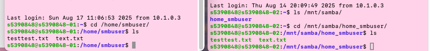
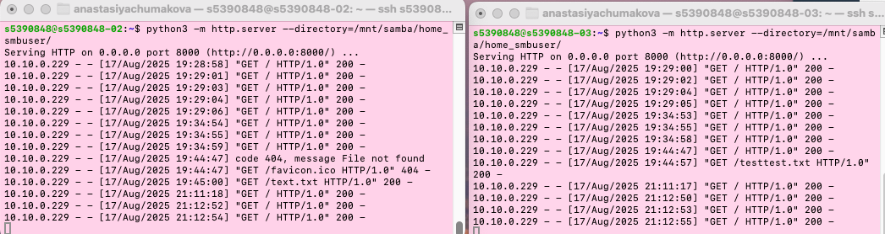

#

# Спринт 3. Настройка файлового и прокси-сервера
## Задание №1. Настройка файлового сервера и монтирование директории. 
### 1. Создать две виртуальные машины через CloudShell - https://cloudshell.sysadmin.education-services.ru/
### 2. Настроим файловый сервер на первой VM 10.10.0.229

- Подключаемся к серверу по SSH-протоколу, используя логин s5390848 и IP-адрес 10.10.0.229
```commandline
ssh s5390848@10.10.0.229
```

-  Обновляем список доступных пакетов и их версий в системе Ubuntu/Debian
```commandline
sudo apt-get update
```
-  Устанавливаем пакет Samba 
```commandline
sudo apt install samba -y
```
- Создаем нового пользователя smbuser с домашним каталогом 
```commandline
sudo useradd -m smbuser
```
- Добавляем пользователя smbuser в базу паролей Samba и устанавливаем для него пароль.
```commandline
sudo smbpasswd -a smbuser
```
- Предоставляем полные права доступа (777) всем пользователям к домашнему каталогу /home/smbuser/
```commandline
sudo chmod 777 /home/smbuser/
```
- Создаем копию оригинального файла конфигурации Samba
```commandline
sudo cp /etc/samba/smb.conf /etc/samba/smb_backup.conf
```
-  Открываем файл конфигурации Samba для редактирования и добавляем/изменяем следующие настройки:
```commandline
sudo nano /etc/samba/smb.conf
```
```commandline
[global]
   security = user
   # остальные настройки...

[home_smbuser]
   path = /home/smbuser
   guest ok = yes
   read only = yes
   writable = no
   public = yes
   valid users = smbuser
```
- Выполним перезапуск службы Samba
```commandline
sudo systemctl restart smbd.service
```
### 3. Настроим автомонтирование на второй VM 10.11.1.208
-  Подключаемся к клиентскому серверу по SSH-протоколу
```commandline
ssh s5390848@10.11.1.208
```
- Обновляем список доступных пакетов в системе
```commandline
sudo apt-get update
```
-  Устанавливаем пакет cifs-utils
```commandline
sudo apt-get install cifs-utils -y
```
- Создаем директорию, где будут монтироваться ресурсы
```commandline
sudo mkdir /mnt/samba/
```
- Выполняем тестовое ручное монтирование 
```commandline
sudo mount.cifs //10.10.0.229/home_smbuser /mnt/samba
```
- Отмонтируем 
```commandline
sudo umount -a -t cifs -l
```
- Устанавливаем autofs
```commandline
sudo apt-get install autofs
```
- Создаем папку для хранения кастомных конфигураций
```commandline
sudo mkdir /etc/autofs/
```
- Редактируем основной конфигурационный файл /etc/auto.master (после установки autofs появится атвоматически)
```commandline
sudo nano /etc/auto.master
```
Конфиг будет выглядеть так (добавляется только последняя строка, первые две оставляем без изменений)
```commandline
+dir:/etc/auto.master.d
+auto.master
/mnt/samba /etc/autofs/auto.samba --timeout 60 --browse
```
- Создаем и редактируем файл с правилами монтирования
```commandline
home_smbuser -fstype=cifs,username=smbuser,password=123456 ://10.10.0.229/home_smbuser
```
- Перезапускаем службу autofs для применения настроек
```commandline
sudo systemctl restart autofs
```

### 4. Проверяем работу автомонтирования 

Для проверки автомонтирования создаем текстовые файлы на первой VM в домашней директории smbuser (/home/smbuser).
После их создания заходим на вторую VM и проверяем их нализие по пути /mnt/samba/home_smbuser/



## Задание №2. Настройка прокси-сервера.
### 1. Создать третью VM через CloudShell - https://cloudshell.sysadmin.education-services.ru/
### 2. Настроим автомонтирование на третьей VM 10.12.0.59 
Повторяем шаги из задания №1
### 3.  Проверяем работу автомонтирования 
Повторяем шаги из задания №1

### 4. Запускаем на VM 2 и 3 ( где настраивали автомонтирование) python - сервер
```commandline
python3 -m http.server 8000 --directory=/mnt/samba/home_smbuser/
```

### 5. На первой VM ( где настроен cifs - сервер) нужно установить и настроить nginx
- Устанавливаем nginx
```commandline
sudo apt install nginx -y
```
- Настраиваем конфигурацию nginx в /etc/nginx.conf
```commandline
sudo nano /etc/nginx/nginx.conf
```
Изменения

```commandline
http {
...
upstream python_servers {
    server 10.11.1.208:8000;
    server 10.12.0.59:8000;
    }
    ...
    server {
	    listen 80;
            server_name _;
            location / {
	        proxy_pass http://python_servers;
            }
	}
	...
}
```

### 6. Отправляем подряд несколько curl-запросов чтобы проверить работу балансировщика
```commandline
curl -X GET 'http://10.10.0.229'
```
Видим что запросы направляются на каждый сервер по очереди (по умолчанию round robin)


## Дополнительное задание. Попробуйте отправлять curl-запросы к конкретному веб-серверу, находящемуся за прокси. 

Отправим curl запрос к 10.12.0.59
```commandline
 curl -X GET 'http://10.12.0.59:8000'
```
Ответ получаем. К конкретному веб серверу, находящемуся за прокси, можно обратиться напрямую


