# Спринт 4. Настройка мониторинга

## Подготовка
1. Установим нужный пакет с БД
```commandline
sudo apt update

sudo apt install mysql-server

sudo systemctl start mysql
```

2. Установим репозиторий Zabbix
```commandline
sudo wget https://repo.zabbix.com/zabbix/6.4/ubuntu/pool/main/z/zabbix-release/zabbix-release_6.4-1+ubuntu22.04_all.deb
sudo dpkg -i zabbix-release_6.4-1+ubuntu22.04_all.deb
sudo apt update
```

3. Устанавливаем необходимые пакеты

```commandline
sudo apt install zabbix-server-mysql zabbix-frontend-php zabbix-nginx-conf zabbix-sql-scripts zabbix-agent
```

4. Создаём базу для нашей системы мониторинга с помощью уже установленного пакета mysql
```commandline
sudo mysql -uroot -p
722121
mysql> create database zabbix character set utf8mb4 collate utf8mb4_bin;
mysql> create user zabbix@localhost identified by '722121';
mysql> grant all privileges on zabbix.* to zabbix@localhost;
mysql> set global log_bin_trust_function_creators = 1;
mysql> quit;
```
5. Извлекаем схему базы данных Zabbix из архива server.sql.gz, распаковываем её и передаём результат в mysql, которая импортирует схему с указанной кодировкой и учётными данными пользователя.

```commandline
sudo zcat /usr/share/zabbix-sql-scripts/mysql/server.sql.gz | mysql --default-character-set=utf8mb4 -uzabbix -p zabbix
```

6. Изменим значение переменной конфигурации, чтобы ограничить доступ к функциям создания

```commandline
sudo mysql -uroot -p
722121
mysql> set global log_bin_trust_function_creators = 0;
mysql> quit;
```

7. Внесем изменения в файл конфигурации /etc/zabbix/zabbix_server.conf. Укажем пароль

```commandline
 sudo nano /etc/zabbix/zabbix_server.conf
 ...
 DBPassword=722121
```

8. В файле конфигурации веб-сервера /etc/zabbix/nginx.conf раскомментируем следующие строки:

```commandline
sudo nano /etc/zabbix/nginx.conf
...
# listen 8080;
# server_name 10.10.1.93; 
```
9. Перезапустим службы Zabbix сервера и агента:

```commandline
sudo systemctl restart zabbix-server zabbix-agent nginx php8.1-fpm
```

10. Добавим в автозапуск служб Zabbix сервер и агента:

```commandline
sudo systemctl enable zabbix-server zabbix-agent php8.1-fpm
```
11. Открываем файл настройки по пути /etc/nginx/sites-enabled/default — с помощью редактора nano или другого — и изменяем строку root /var/www/html на root /usr/share/zabbix. После этого перезапускаем Nginx:

```commandline
sudo nano /etc/nginx/sites-enabled/default
 ...
root /usr/share/zabbix;
```

Перезапускаем nginx
```commandline
sudo systemctl restart nginx
```
11. Прежде чем открыть Zabbix в браузере, важно добавить правила для файрвола UFW. Так мы разрешим доступ к портам, с которыми работает Zabbix и Nginx, — 10050/tcp, 10051/tcp и 80/tcp. Перезагружаем наши правила:

```commandline
sudo ufw allow 10050/tcp
sudo ufw allow 10051/tcp
sudo ufw allow 80/tcp
sudo ufw reload
```
Теперь zabbix можно открыть в браузере по адресу http://10.10.1.93:8080

12. Выполним русификацию 

```commandline
sudo sed -i  "s/# ru_RU.UTF-8 UTF-8/ru_RU.UTF-8 UTF-8/g" /etc/locale.gen
sudo locale-gen
sudo systemctl restart zabbix-server nginx php8.1-fpm 
```

13. Создайте нового пользователя — это нужно для выполнения заданий. Перейдите в раздел «Пользователи» и нажмите на кнопку «Создать пользователя» в правой верхней части экрана. 
 Дальше заполните поля и добавьте пользователя в группу Zabbix Administartors. Перейдите по ссылке «Права доступа» и назначьте ему роль Admin role.

Создан пользователь achumakova / 1qaz!QAZXSW@2wsx

Результат:
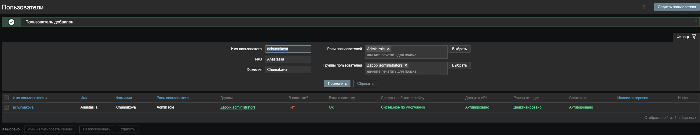

## Задание №1. Мониторинг сайта yandex.ru.

- Создайте для узла сети Zabbix server веб-сценарий с именем «Проверка сайта yandex.ru». 
Для этого перейдите в раздел `«Сбор данных» → «Узлы сети»`, а затем в строке с Zabbix server кликните по ссылке Веб.
На открывшейся странице в правом верхнем углу будет кнопка «Создать веб-сценарий».
Настройте сценарий с одним шагом: назовите его «Открыть сайт», а URL задайте https://yandex.ru. 
Установите тег `component=web` для более удобной фильтрации при отладке.

Результат
1. Сценарий

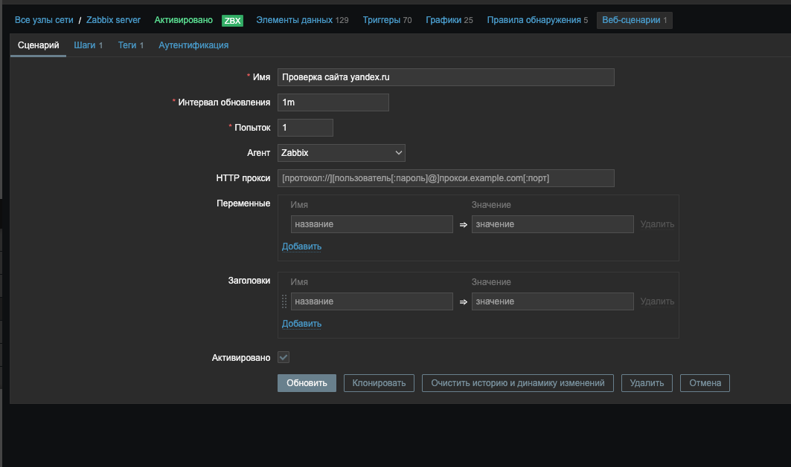
2. Шаги

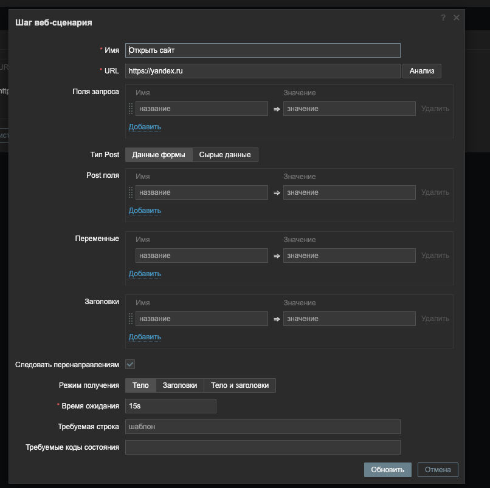

3. Теги

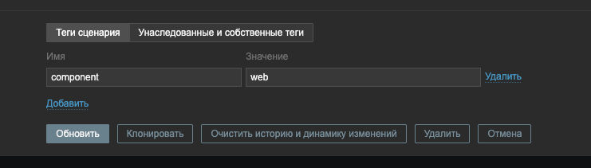

- Создайте триггер с именем `«Сайт yandex.ru недоступен»`, который будет реагировать в случае недоступности сайта.
Для проверки доступности используйте элемент данных `Failed step of scenario`.
- 
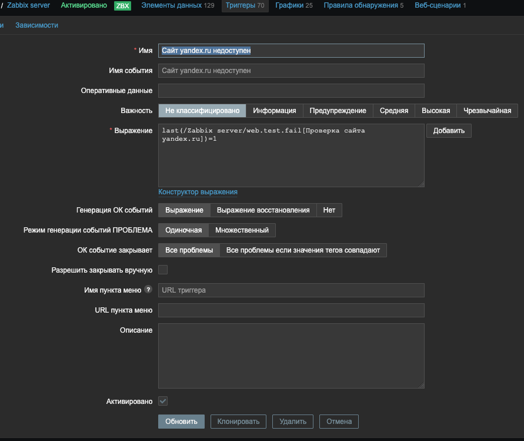

Результат: перейдем в мониторинг и убедимся в корректном сборе данных по веб-сценарию
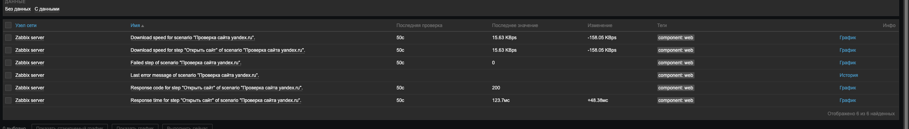

- Убедитесь, что проблема возникает при нарушении связи между Zabbix-сервером и https://yandex.ru, 
и что всё приходит в норму, когда связь восстанавливается. 
В разделе «Мониторинг» → «Проблемы» должна появляться и исчезать проблема.

Создадим сбой:
```commandline
sudo ufw allow 22/tcp
sudo ufw allow 8080/tcp
sudo ufw deny out 443/tcp
sudo ufw show added
sudo ufw enable
```
Результат:

1. "Мониторинг" > "Последние данные"

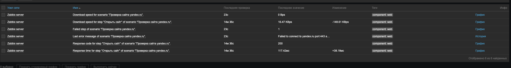

2. "Мониторинг" > "Последние данные"


Текст ошибки
```commandline
30.08.2025 01:07:14	Failed to connect to yandex.ru port 443 after 13176 ms: Connection timed out
```

Восстановим сбой:
```commandline
sudo ufw disable
```
Доступ восстановлен:

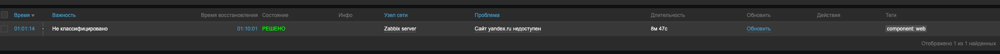

## Задание №2. Проверка доступности сервера yandex.ru.
- Создайте для узла сети Zabbix server элемент данных `«Яндекс сервер»` с типом `«Простая проверка»` и ключом `icmpping`.
Для ключа `icmpping` достаточно указать только один параметр — `target`.

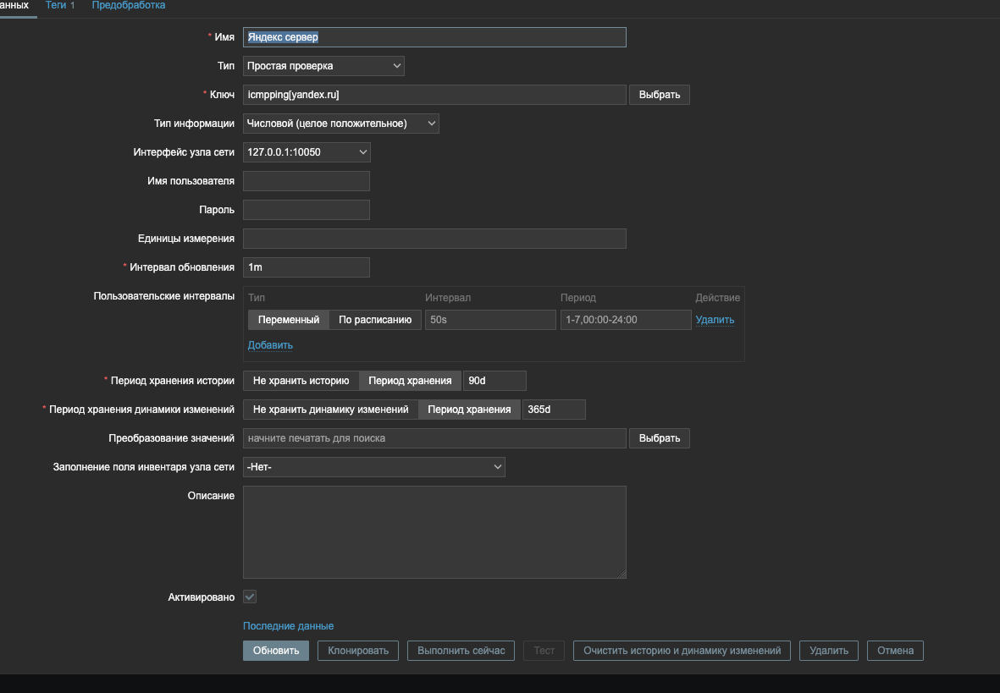

- Создайте триггер с возможностью ручного закрытия для этого элемента — он должен срабатывать, если ping не проходит. 
Назовите его «Сервер Яндекс недоступен».

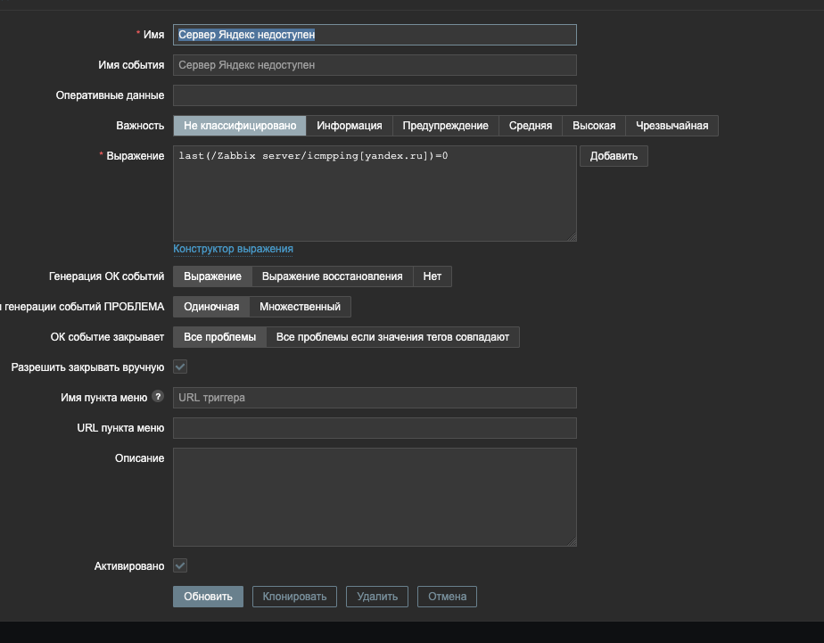

- Сымитируйте сбой и проверьте, что в интерфейсе Zabbix в разделе «Мониторинг» → «Проблема» 
появляется запись при пропадании связи с сервером.
Закройте проблему вручную: переведите её в статус «Решено» в интерфейсе Zabbix, 
используя опцию «Закрыть проблему» в свойствах.

Создадим сбой: добавьте в файл `/etc/hosts` строку `172.0.0.1 yandex.ru`. 
Для восстановления нормальной работы закомментируйте её.

Результат:
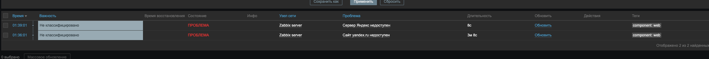

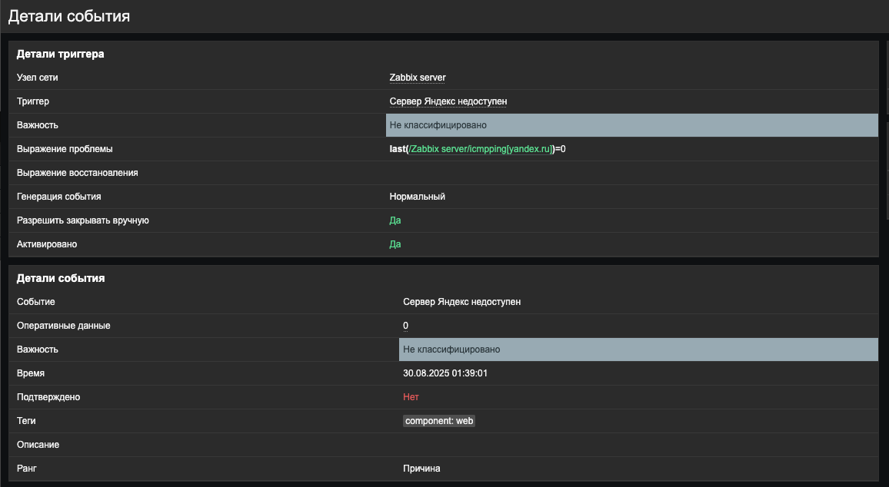

## Задание №3. Установка зависимостей проверок.
- Настройте триггер «Сайт yandex.ru недоступен» зависимым от `«Сервер Яндекс недоступен»`.
- Сымитируйте сбой доступа для сервера: раскомментируйте строку в файле `/etc/hosts` из предыдущего задания.
- Удостоверьтесь, что проблема появляется только с элементом `«Сервер Яндекс недоступен»`, и восстановите связь.
- Сымитируйте сбой доступности сайта из первого задания — `ufw enable`.
- Убедитесь, что появляется только проблема `«Сайт yandex.ru недоступен»`, и восстановите доступность сайта — `ufw disable`.

Результат:
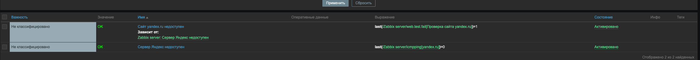